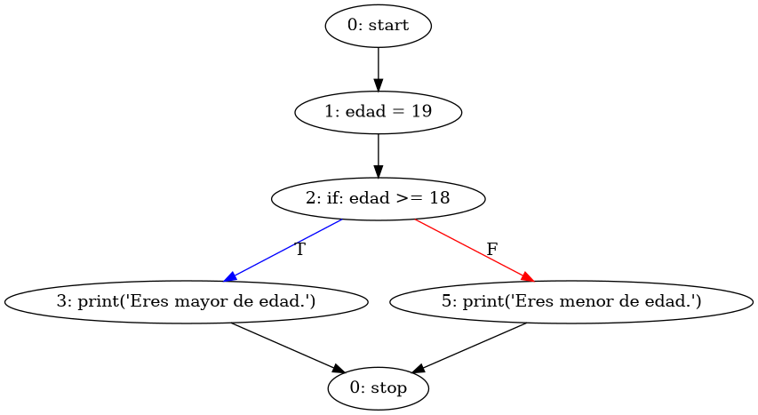
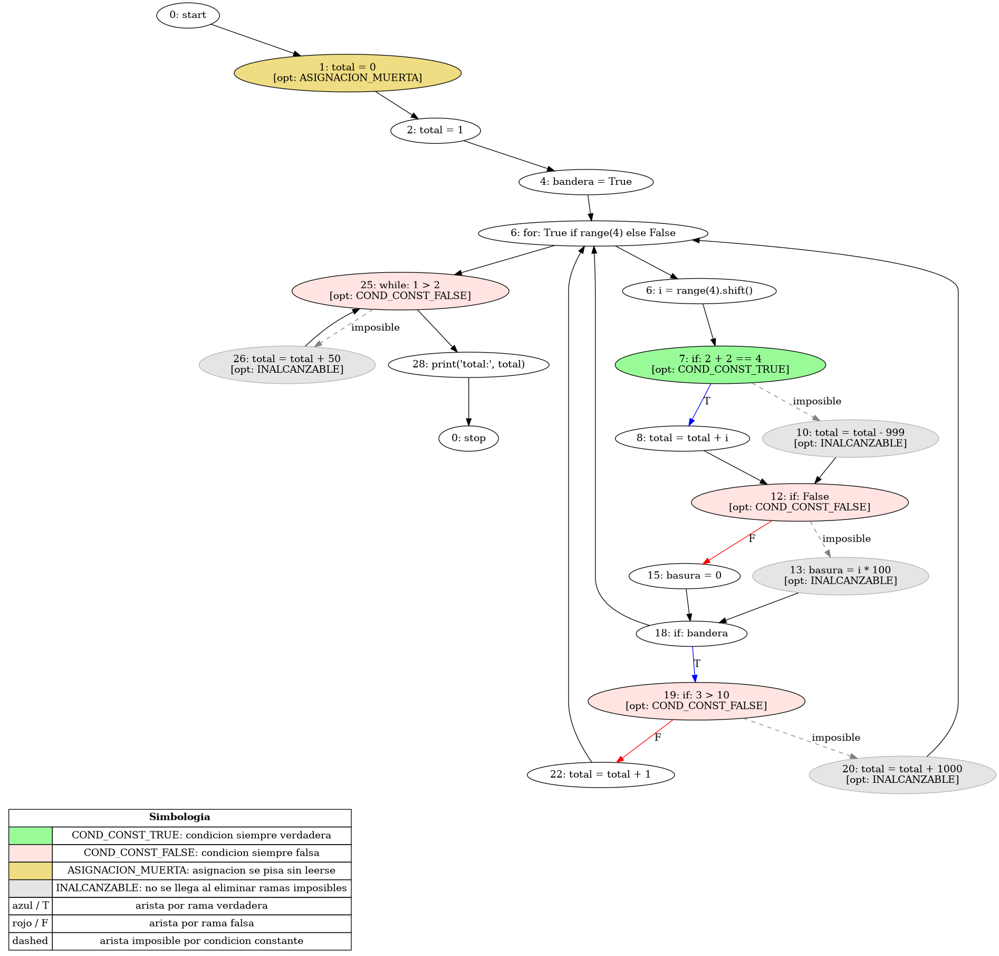

# Generador de Control Flow Graph

Este proyecto es un generador de grafos de flujo de control (Control Flow Graph, CFG) para programas escritos en Python. Utiliza la biblioteca `ast` de Python para analizar el código fuente y construir el grafo correspondiente. Además, emplea la biblioteca `graphviz` para visualizar el grafo generado.

## Instalación

### 1. Clonar el repositorio

### 2. Crear un entorno virtual (opcional pero recomendado)

```bash
python -m venv venv
source venv/bin/activate  # En Windows usa `venv\Scripts\activate`
```

### 3. Instalar las dependencias

```bash
pip install -r requirements.txt
```

## Uso

Para generar un CFG a partir de un archivo Python, ejecuta el siguiente comando:

```bash
python cfg_generator.py ruta/al/archivo.py
```

El grafo se guardará en un archivo llamado igual al nombre del archivo de entrada, pero con la extensión `.png`.

## Ejemplos

En la carpeta `examples`, encontrarás varios archivos Python de ejemplo que puedes usar para probar el generador de CFG:

### if

```python
edad = 19
if edad >= 18:
    print("Eres mayor de edad.")
else:
    print("Eres menor de edad.")
```



### Codigo optimizable

En la carpeta `examples`, también hay un archivo llamado `optimizable.py` que contiene código que puede ser optimizado. Tiene condiciones redundantes, codigo inaccesible y variables sin uso.

```python
total = 0
total = 1  # asignacion muerta (se pisa sin leerse)

bandera = True

for i in range(4):
    if 2 + 2 == 4:          # condicion constante true
        total = total + i
    else:
        total = total - 999  # inalcanzable

    if False:               # condicion constante false
        basura = i * 100    # inalcanzable
    else:
        basura = 0

    # if anidado para que se vea mas estructura
    if bandera:
        if (3 > 10):        # condicion constante false
            total = total + 1000  # inalcanzable
        else:
            total = total + 1

# while con condicion constante false
while 1 > 2:
    total = total + 50      # inalcanzable

print("total:", total)
```


